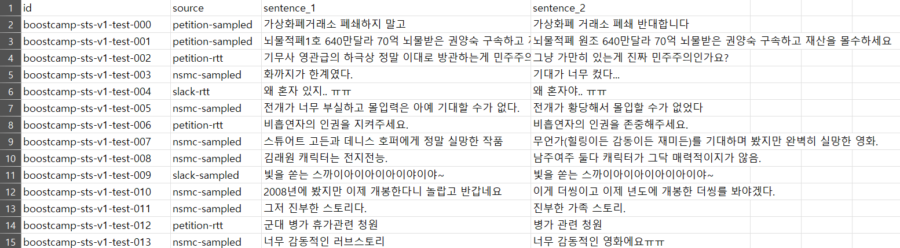

# 문장 간 유사도 측정

 
 

 
 

**의미 유사도 판별(Semantic Text Similarity, STS)**이란  
**두 문장이 의미적으로 얼마나 유사한지를 수치화하는 자연어처리 태스크**입니다.

## 📌 Description
보고서나 논문 등의 정보 전달 목적의 글을 쓰다보면, 같은 말을 반복해서 쓰게 되는 경우가 많습니다. 중복된 문장들은 가독성을 떨어뜨리는 요인 중 하나로써, 글의 퀄리티가 낮아지게 만들죠. 이런 경우 인간은 교정 작업을 하며, 의미적으로 중복된 문장을 인지하고 수정하게 됩니다. 그렇다면 기계의 경우 서로 구조적으론 다르지만, 의미가 유사한 것을 어떻게 구별할 수 있을까요?  


이런 경우에 사용할 수 있는 Task가 바로, **Semantic Text Similarity (STS)**입니다. STS란 두 텍스트가 얼마나 유사한지 판단하는 NLP Task입니다. 일반적으로 두 개의 문장을 입력하고, 이러한 문장쌍이 얼마나 의미적으로 서로 유사한지를 판단합니다.  

 

관계를 예측한다는 점에서 **Textual Entailment (TE)**와 헷갈릴 수 있습니다. 두 문제의 가장 큰 차이점은 **‘방향성’**입니다. STS는 두 문장이 서로 동등한 양방향성을 가정하고 진행되지만, TE의 경우 방향성이 존재합니다. 예를 들어 "자동차는 운송수단이다."라는 문장은 참이지만, 운송수단이 반드시 자동차다."라고 할 수는 없습니다. 또한 출력 형태에서도 차이가 있습니다. TE, STS 모두 관계 유사도에 대해 참/거짓으로 판단할 수 있지만, STS는 수치화된 점수를 출력할 수도 있습니다.  

이처럼 STS의 수치화 가능한 양방향성은 정보 추출, 질문-답변 및 요약과 같은 NLP 작업에 널리 활용되고 있습니다. 실제 어플리케이션으로는 데이터 증강, 챗봇의 질문 제안, 혹은 중복 문장 탐지 등에 응용되고 있습니다.  

우리는 **STS 데이터셋을 활용해 두 문장의 유사도를 측정하는 AI 모델을 구축**할 것입니다. 유사도 점수와 함께 두 문장의 유사함을 참과 거짓으로 판단하는 참고 정보도 같이 제공하지만, 최종적으로 **0과 5 사이의 유사도 점수를 예측**하는 것을 목표로 합니다!  

**📥 Input** : 두 개의 문장과 ID, 유사도 정보가 담긴 CSV 파일  
**📤 Output** : 평가 데이터에 있는 각 문장쌍에 대한 ID와 유사도 점수가 담긴 CSV 파일  

## 📊 Metric
**피어슨 상관 계수(Pearson Correlation Coefficient, PCC)**는 두 변수 X 와 Y 간의 선형 상관 관계를 계량화한 수치로, 보통 상관관계라 함은 피어슨 상관관계를 칭합니다. 코시-슈바르츠 부등식에 의해 -1~1 사이의 값을 가지며, +1은 완벽한 양의 선형 상관 관계, 0은 선형 상관 관계 없음, -1은 완벽한 음의 선형 상관 관계를 의미합니다.


피어슨 상관 계수는 정답과 예측이 일치하지 않더라도 증감율이 일치하면 1에 가까운 값을 보입니다. 반대로 정답값과 예측이 근사하더라도 증감율이 다르면 -1에 가까운 값을 보일 수 있습니다. 이는 정답을 정확히 예측하는 것 보다, 높은 값은 확실히 높게, 낮은 값은 확실히 낮게, 즉 전체적인 경향을 잘 예측하는 것이 중요함을 의미합니다.

## ⏳ Timeline
2024.09.11 ~ 2024.09.26

## 🔍 Dataset Overview
주요 데이터는 csv 형태로 제공되며 주어지는 두 문장 간의 유사도를 예측하는 것이 최종 목표입니다. 데이터셋의 train/dev/test 은 85/5/10의 비율로 나누어졌습니다.

### **학습 데이터 개요**
아래는 학습 데이터를 구성하는 각 데이터의 개수와 Label 점수의 의미입니다.
- 총 데이터 개수 : 9,874 문장 쌍
    - Train 데이터 개수: 9,324
    - Dev 데이터 개수: 550
- Label 점수: 0 ~ 5사이의 실수
    - 5점 : 두 문장의 핵심 내용이 동일하며, 부가적인 내용들도 동일함
    - 4점 : 두 문장의 핵심 내용이 동등하며, 부가적인 내용에서는 미미한 차이가 있음
    - 3점 : 두 문장의 핵심 내용은 대략적으로 동등하지만, 부가적인 내용에 무시하기 어려운 차이가 있음
    - 2점 : 두 문장의 핵심 내용은 동등하지 않지만, 몇 가지 부가적인 내용을 공유함
    - 1점 : 두 문장의 핵심 내용은 동등하지 않지만, 비슷한 주제를 다루고 있음
    - 0점 : 두 문장의 핵심 내용이 동등하지 않고, 부가적인 내용에서도 공통점이 없음

각 데이터별 Label 점수는 여러명의 사람이 위의 점수 기준을 토대로 평가한 두 문장간의 점수를 평균낸 값입니다. 두 문장간의 유사도는 사람마다 다르게 평가될 수 있다는 점을 고려하여 데이터를 확인해주세요.

데이터 구조인 각 column 별 설명입니다. 예측 타겟 값은 0 ~ 5점 사이의 값입니다. 데이터는 id를 기준으로 정렬되어 있습니다.


- id (문자열) : 문장 고유 ID입니다. 데이터의 이름과 버전, train/dev/test가 적혀 있습니다.
- source (문자열) : 문장의 출처로 총 3가지 source 가 있습니다.
    - petition (국민청원 게시판 제목 데이터)
    - NSMC (네이버 영화 감성 분석 코퍼스, Naver Sentiment Movie Corpus)
    - slack (업스테이지(Upstage) 슬랙 데이터)
- sentence1 (문자열) : 문장 쌍의 첫번째 문장입니다.
- sentence2 (문자열) : 문장 쌍의 두번째 문장입니다.
- label : 문장 쌍에 대한 유사도로 0~5 점으로 소수 첫째 자리까지 있습니다.
- binary-label : 문장 쌍에 대한 유사도가 2점 이하인 경우엔 0으로, 3점 이상인 경우엔 1로 변환한 binary label 입니다.

제공되는 데이터는 train.csv / dev.csv / test.csv / sample_submission.csv의 4개의 파일로 되어있으며 train.csv, dev.csv 파일로 학습하여 모델을 생성합니다.

### **평가 데이터 개요**
- 평가 데이터는 1,100개로 구성되어 있으며, 학습 데이터와 달리 label 및 binary_label column이 없습니다.




## 📂 Code
코드 파일은 requirements.txt, process_data.py, augment_data.py, train.py, inference.py, ensemble_models.py 여섯 가지로 구성되어 있습니다.

- **requirements.txt** : `train.py`와 `inference.py`를 실행하는데 필요한 라이브러리들이 담겨있는 txt 파일입니다.
- **process_data.py** : 데이터 전처리를 수행하는 코드입니다.
- **augment_data.py** : 데이터 증강을 수행하는 코드입니다.
- **train.py** : 데이터 학습에 사용되는 코드입니다.
- **inference.py** : 학습된 모델로 데이터를 예측하는 코드입니다.
- **ensemble_models.py** : 여러 모델을 앙상블하여 최종 예측을 수행하는 코드입니다.

코드는 다음 순서로 실행합니다:
1. `requirements.txt`
2. `process_data.py`
3. `augment_data.py`
4. `train.py`
5. `inference.py`
6. `ensemble_models.py`

### **requirements.txt**
- `requirements.txt`에는 `train.py`와 `inference.py`를 실행하기 위해 필요한 라이브러리들이 담겨있습니다.
- `train.py`와 `inference.py` 코드를 제작할 때 활용되었던 버전을 명시하였습니다.
- 아래 명령어를 통해 `requirements.txt`의 라이브러리들을 한번에 설치할 수 있습니다:
  ```bash
  pip install -r requirements.txt
  ```

### **process_data.py**
- `process_data.py`는 데이터 전처리를 수행하는 코드입니다.
- 학습 데이터에서 특정 레이블(`label == 0`)의 샘플을 1500개로 제한하여 **Undersampling**을 수행합니다.
- Undersampling된 데이터를 기존 데이터와 결합하여 새로운 학습 데이터를 생성합니다.
- 최종 전처리된 데이터를 `preprocessed_train.csv` 파일로 저장합니다.

✅ **실행 방법**
```bash
python3 process_data.py
```

### **augment_data.py**
- `augment_data.py`는 데이터 증강을 수행하는 코드입니다.
- 문장 순서 변경, 동일 문장 추가, 역번역(Back-Translation)을 이용하여 데이터의 다양성을 증가시킵니다.
- **문장 순서 변경**: 문장 쌍의 순서를 바꿔 새로운 학습 데이터를 생성합니다.
- **동일 문장 추가**: 동일한 문장 쌍을 추가하여 유사도 학습을 강화합니다.
- **역번역**: Papago API를 활용하여 한국어-일본어-한국어 방식으로 번역하여 데이터 다양성을 확보합니다.
- 최종 증강된 데이터를 `augmented_train.csv` 파일로 저장합니다.

✅ **실행 방법**
```bash
python3 augment_data.py
```

### **train.py**
- `train.py`는 데이터 호출 및 전처리를 위한 Dataset과 Dataloader, 학습에 사용되는 Model이 구현되어 있습니다.
- ArgumentParser에는 다음과 같은 인자가 있습니다. :
    - `--model_name`은 학습에 사용되는 선학습 모델입니다.
    - `--batch_size`는 학습에 사용되는 배치 크기입니다.
    - `--max_epoch`은 학습의 총 에폭입니다.
    - `--shuffle`은 train 데이터셋의 순서를 섞을지 말지 결정하는 인자입니다.
    - `--learning_rate`는 모델의 learning rate입니다.
    - `--train_path`, `--dev_path`, `--test_path`, `--predict_path`는 각 데이터의 경로입니다.
    - `--num_workers`는 데이터 로딩을 위한 worker 개수를 설정하는 인자입니다.
- Train part의 순서는 다음과 같습니다 :
    1. Optuna를 이용하여 최적의 하이퍼파라미터를 탐색합니다.
    2. Dataloader와 Dataset 클래스를 사용해 데이터를 준비합니다.
    3. 사용하는 선학습 모델에 맞는 토크나이징을 활용하여, 두 문장을 `[SEP]` 토큰으로 이어붙여서 활용합니다.
    4. 토큰의 최대 길이는 160으로 사용하고, 토큰이 부족하다면 `[PAD]` 토큰을 추가하고, 토큰이 넘친다면 뒷 부분을 잘라 활용합니다.
    5. Model 클래스를 사용해 모델을 설정하고 준비합니다.
    6. Trainer와 Dataloader, Model을 사용하여 학습을 수행합니다.
    7. 학습이 완료되면, `torch.save(model, 'model.pt')`를 통해 학습된 모델을 `model.pt`라는 파일로 저장하게 됩니다.

✅ **실행 방법**
```bash
python3 train.py
```

### **inference.py**
- `inference.py`는 `train.py`에서 학습된 모델을 호출하여 문제 데이터셋을 예측하는 코드입니다.
- Inference part의 순서는 다음과 같습니다 :
    1. `train.py`에서 저장된 `model.pt`를 호출하여 데이터 예측을 진행합니다.
    2. 예측된 결과를 제출 형식에 맞게 변경하여 준비합니다.
    3. `sample_submission.csv`를 불러와 target만 예측된 결과로 변경하고 `output.csv`로 저장합니다.
- 코드 실행이 끝나면 `output.csv`라는 예측 결과 파일이 생성되고 리더보드에 제출할 수 있습니다.

✅ **실행 방법**
```bash
python3 inference.py
```

### **ensemble_models.py**
- `ensemble_models.py`는 여러 모델을 앙상블하여 최종 예측을 수행하는 코드입니다.
- `train.py`에서 학습한 여러 모델을 불러와 테스트 데이터에 대한 예측을 수행하고, 평균을 내어 최종 결과를 도출합니다.
- 코드 실행이 끝나면 `output.csv`라는 예측 결과 파일이 생성되고 리더보드에 제출할 수 있습니다.

✅ **실행 방법**
```bash
python3 ensemble_models.py
```

## 👥 Team
| 이름   | 역할 |
|--------|----------------------------------|
| 김경인 | 데이터 증강, 모델 선정 및 분석 |
| 김준섭 | 모델 선정 및 분석, 모델 평가 및 개선 |
| 김채연 | 데이터 분석, 모델 선정 및 분석 |
| 박상준 | 데이터 분석, 데이터 증강 |
| 이다현 | 데이터 증강, 모델 평가 및 개선 |
| 이시온 | 데이터 전처리, 모델 선정 및 분석 |
